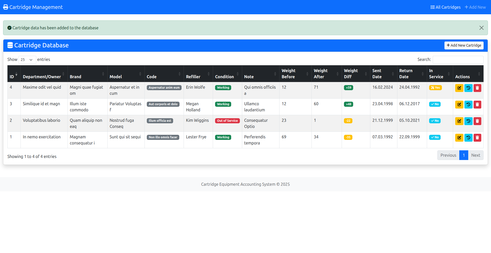

# Legacy to Modern Migration Project

This project documents the migration of a legacy CodeIgniter 3 (PHP 5.4) application to a modern Laravel 12 application running in a Dockerized environment.

## Table of Contents

- [Legacy System (CodeIgniter 3.x)](#legacy-system-codeigniter-3x)
  - [Overview](#overview)
  - [Docker Setup for Legacy](#docker-setup-for-legacy)
- [Modern System (Laravel 12 + Docker)](#modern-system-laravel-12--docker)
  - [Overview](#overview-1)
  - [Docker Setup](#docker-setup)
  - [Directory Structure](#directory-structure)
  - [Environment Setup](#environment-setup)
  - [Planned Database Improvements](#planned-database-improvements)
  - [Planned API Endpoints](#planned-api-endpoints)
  - [Migration Strategy](#migration-strategy)
  - [Technology Stack](#technology-stack)
  - [Development Workflow](#development-workflow)
- [Example: Legacy → Modern Migration](#example-legacy--modern-migration-controller-method)

---

## UI Comparison (Legacy vs Modern)

| Legacy (CodeIgniter + Bootstrap)                             | Modern (Laravel + Tailwind)                  |
|--------------------------------------------------------------|----------------------------------------------|
|  |  |


## Example: Legacy → Modern Migration (Controller Method)

Below is a practical example of how a legacy CodeIgniter 3 controller method is transformed into a clean and modern Laravel 12 controller method.

### Legacy CodeIgniter 3 Method (addcartridgedata)

```php
public function addcartridgedata()
{
    $today = getdate();
    $d = $today['mday'];
    $m = $today['mon'];
    $y = $today['year'];

    if ($_POST) {
        $data = array(
            'owner'          => $this->input->post('owner'),
            'brand'          => $this->input->post('brand'),
            'marks'          => $this->input->post('marks'),
            'code'           => $this->input->post('code'),
            'servicename'    => $this->input->post('servicename'),
            'technical_life' => $this->input->post('technical_life'),
            'comments'       => $this->input->post('comments'),
            'weight_before'  => $this->input->post('weight_before'),
            'weight_after'   => $this->input->post('weight_after'),
            'date_income'    => date("$y-$m-$d")
        );

        if ($this->cartridge_model->insertcartridge($data)) {
            $this->session->set_flashdata(
                'msg',
                '<div class="alert alert-success text-center">Данные о картридже добавлены в базу данных</div>'
            );
            redirect(base_url().'cartridge/addcartridgedata', 'refresh');
        } else {
            $this->session->set_flashdata(
                'msg',
                '<div class="alert alert-danger text-center">Чёт пошло не так</div>'
            );
            redirect(base_url().'cartridge/addcartridgedata', 'refresh');
        }
    } else {
        $this->load->view('add_cartridge');
    }
}
````

---

### Modern Laravel 12 Equivalent (store)

```php
public function store(StoreCartridgeRequest $request): RedirectResponse
{
    Cartridge::create($request->validated());

    return redirect()
        ->route('cartridges.index')
        ->with('success', 'Cartridge data has been added to the database');
}
```

---

### Key Improvements in Laravel

| Legacy (CodeIgniter)           | Modern (Laravel 12)                      |
| ------------------------------ | ---------------------------------------- |
| Manual `$_POST` handling       | Strong typed validation via Form Request |
| Manual date construction       | Automatic timestamps or `Carbon::now()`  |
| Raw SQL model methods          | Eloquent ORM                             |
| Flash messages stored manually | `with('success', '...')`                 |
| Hardcoded redirects            | Named routes                             |
| Manual view loading            | Blade + resource controllers             |

---

## Legacy System (CodeIgniter 3.x)

### Overview

* **Application**: Cartridge Management System (Система учёта картриджей)
* **Framework**: CodeIgniter 3.x
* **PHP Version**: 5.3.7+
* **Database**: MySQL
* **Base URL**: `http://cartridge.crud`

Additional details:
`./legacy-codeigniter-php5-4/readme.md`

---

### Docker Setup for Legacy

**Services:**

* **Web**: PHP 5.6 + Apache (8080)
* **Database**: MySQL 5.7 (3306)
* **phpMyAdmin**: 8081

**Quick Start**

```bash
cd legacy-codeigniter-php5-4
docker-compose up -d --build
```

**Access:**

* `http://localhost:8080`
* `http://localhost:8081`

More details:
`legacy-codeigniter-php5-4/readme/DOCKER_SETUP.md`

---

## Modern System (Laravel 12 + Docker)

Detailed description:
`./modern-laravel/readme.md`

### Overview

* **Framework**: Laravel 12
* **PHP Version**: 8.3+
* **Database**: MySQL 8.0
* **Server**: Nginx + Docker
* **Architecture**: Modern MVC / API-first
* **Dev Environment**: Laravel Sail

---

### Docker Setup

```bash
cd modern-laravel
./vendor/bin/sail up -d
```

**Services:** Laravel App, MySQL, Redis, Vite

---

### Directory Structure

```
modern-laravel/
├── compose.yaml
├── app/
├── database/
├── resources/
├── routes/
├── tests/
└── vendor/
```

---

### Environment Setup

```bash
cp .env.example .env
./vendor/bin/sail artisan key:generate
./vendor/bin/sail artisan migrate
./vendor/bin/sail artisan db:seed
```

---

## Planned Database Improvements

* Foreign keys
* Indexes
* Soft deletes
* Timestamps
* Optional UUIDs

---

## Planned API Endpoints

```
GET    /api/cartridges
POST   /api/cartridges
GET    /api/cartridges/{id}
PUT    /api/cartridges/{id}
DELETE /api/cartridges/{id}
GET    /api/cartridges/{id}/history
```

---

## Migration Strategy

1. Database migration
2. Model creation
3. Controller refactoring
4. View modernization
5. API development
6. Docker setup
7. Testing

---

## Technology Stack

* Laravel 12 / PHP 8.3
* MySQL 8
* Blade + Tailwind
* Redis
* Docker (Sail)
* PHPUnit, Pest, Dusk

---

## Development Workflow

* Git workflow
* Feature branches
* Automated tests
* Code quality tools
* Dockerized environment
