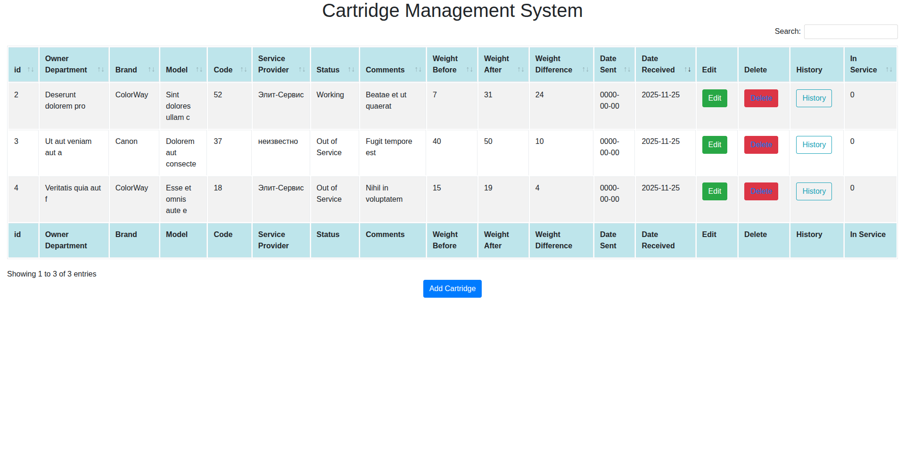
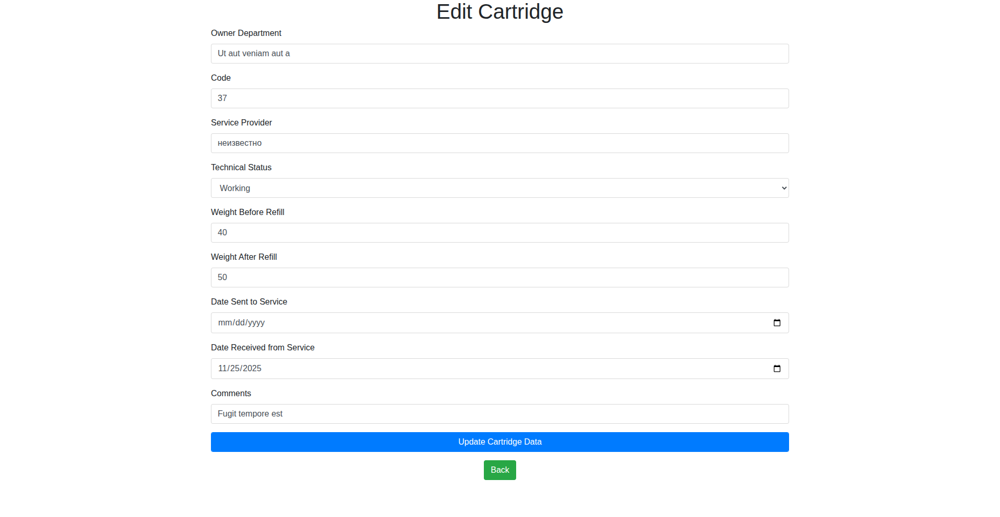
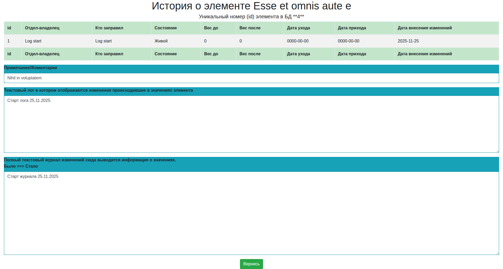

## 💻 Revised README: Simple Equipment/Cartridge Management System

### A Simple CRUD System for Cartridge Accounting (CodeIgniter Legacy)

This system is a straightforward **CRUD (Create, Read, Update, Delete)** application built on the **CodeIgniter 3** (or older) framework, designed for managing a database of printer cartridges.

## ✨ Key Features

* **Core CRUD Operations:** Full management (Add, Edit, Delete) of cartridge records.
* **Audit Logging:** Detailed tracking of changes via a dedicated change log and event log.
* **Localization:** Russian language user interface and logging system.
* **Responsive UI:** Utilizes **Bootstrap 4** for a mobile-friendly interface.
* **Data Presentation:** **DataTables** integration for powerful sorting, filtering, and searching on the main record list.
* **Change History View:** Dedicated view for tracking the complete lifecycle history of each cartridge.

> **⚠️ Legacy Code Note:** This codebase is an older, legacy version.
> * It was likely developed on **CodeIgniter 3** or earlier.
> * It uses direct SQL queries within the model (not standard ORM/Active Record).
> * The original code contains **no comments** for easier maintenance.

---

## 🗃️ Database Schema

The system uses two primary tables: `cartridgedb` for main records and `story` for auditing.

### `cartridgedb` - Primary Cartridge Records

| Column Name | Data Type | Description |
| :--- | :--- | :--- |
| `id` | `INT` (PK, AI) | **Unique Cartridge ID.** |
| `owner` | `VARCHAR(50)` | Department or location where the cartridge is used. |
| `brand` | `VARCHAR(50)` | Manufacturer of the cartridge (e.g., HP, Canon). |
| `marks` | `VARCHAR(50)` | Cartridge model designation. |
| `code` | `VARCHAR(30)` | **Unique Inventory/Identifier Code.** |
| `technical_life` | `TINYINT` | Operational status (e.g., 1=Working, 0=Out of Service). |
| `comments` | `VARCHAR(50)` | Status or general notes on the item. |
| `servicename` | `VARCHAR(30)` | Service center/refiller used. |
| `date_outcome` | `DATE` | Date sent out for service/refill. |
| `date_income` | `DATE` | Date received back from service/refill. |
| `weight_before` | `INT` | Weight in grams before service. |
| `weight_after` | `INT` | Weight in grams after refill/service. |
| `inservice` | `TINYINT` | Auto-calculated status: `1` if currently *in* service (Sent > Return), `0` otherwise. |

### `story` - Change History / Audit Log

| Column Name | Data Type | Description |
| :--- | :--- | :--- |
| `id` | `INT` (PK, AI) | Unique record ID for the history entry. |
| `id_item` | `INT` (FK) | **Foreign Key** referencing `cartridgedb.id`. |
| `date_of_changes` | `DATE` | Timestamp of the change/edit. |
| `log` | `TEXT` | Short, human-readable summary of the changes made. |
| `log_full` | `TEXT` | Detailed log of all field changes (e.g., "Field X: Old Value → New Value"). |

---

## 📂 Application Structure (Legacy CodeIgniter)

The structure follows the classic CodeIgniter **Model-View-Controller (MVC)** pattern.

```

legacy-codeigniter-php5-4/
├── application/
│   ├── controllers/
│   │   └── **Cartridge.php** (Main application logic)
│   ├── models/
│   │   └── **cartridge\_model.php** (Direct DB operations)
│   ├── views/
│   │   ├── **cartridge\_details.php** (Main table view)
│   │   ├── **add\_cartridge.php**
│   │   ├── **edit\_details.php**
│   │   └── **story\_of\_element.php** (History view)
│   └── config/ (Database, URL, and other configs)
├── assets/ (Contains Bootstrap 4, DataTables, jQuery)
├── system/ (CodeIgniter Core Files)
├── DB/ (SQL dumps: cartridgedb.sql, story.sql)
└── ...

````

---

## 🚨 Security and Best Practices Notes

The current version has known limitations that should be addressed in a production environment:

* **No Authentication:** Anyone can access and modify data. **Critical for future versions.**
* **No Authorization:** No roles or permission levels are defined.
* **No CSRF Protection:** Susceptible to Cross-Site Request Forgery attacks.
* **Direct SQL Queries:** Using direct SQL in the model is less secure and harder to maintain than CodeIgniter's Active Record or an ORM.
* **Session Storage:** File-based sessions may not scale well.

---

## 🛠️ Installation Guide

This installation process is standard for a legacy CodeIgniter application.

### Prerequisites

* **Web Server:** Apache or Nginx.
* **PHP:** Version 5.4 or later (though a modern setup should use PHP 7+ or 8+).
* **Database:** MySQL (5.1+ recommended), MariaDB, or any other supported by CodeIgniter (via `mysqli` or `pdo` drivers).

### Installation Steps

1.  **Download and Unpack:** Download the archive and extract it to your web server's root directory (or a subdirectory).
2.  **Database Setup:**
    * Create a database (e.g., `cartridge`) on your MySQL server.
    * Import the SQL files located in the `DB/` folder: `cartridgedb.sql` and `story.sql`.
3.  **Configure CodeIgniter:**
    * Open `application/config/config.php` and set the `$config['base_url']` to your domain or local URL (e.g., `http://localhost/cartridge_system/`).
    * Set a random value for `$config['encryption_key']` if you plan to use sessions/encryption.
    * **Crucially**, open `application/config/database.php` and configure your database connection settings:
        ```php
        'hostname' => 'localhost',
        'username' => 'webuser', // As per the original note
        'password' => 'your_db_password',
        'database' => 'cartridge',
        ```
4.  **Access:** Navigate to your configured base URL in a web browser.

---

## 🖼️ Screenshots

* **Main Dashboard:** 
* **Add New Cartridge:** 
* **Change History:** 

---

## ➡️ Next Steps

The following features were planned or implemented in subsequent versions:

* Full **User Registration and Authentication** system.
* Implementation of **secure data validation**.
* Migration to a modern PHP version and CodeIgniter 4 or a different framework.

---

[](https://youtu.be/KowUUCqxoOQ)
