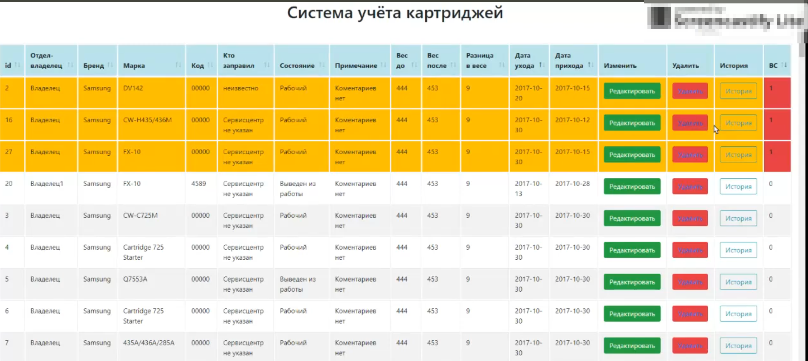

# Simple CRUD System Based on CodeIgniter
### A Simple Equipment Accounting System on CodeIgniter

This accounting system was developed to manage a cartridge database.

## Main Features
- Add, edit, delete elements
- Maintain a change log and event log
- Russian user interface and logging system

> **Note:** The code contains no comments.

> Based on the [CodeIgniter 4 framework](https://codeigniter.com/),  
> with [Bootstrap 4](http://getbootstrap.com/) for UI styling  
> and [DataTables](https://datatables.net/) for table sorting and filtering.

---

## Installation

The easiest way is to download and unpack the archive.  
Database files with tables can be found in the root folder.  
Installation is nearly identical to standard CodeIgniter installation.

### Installation Steps

CodeIgniter installation goes through four stages:

1. Unpack the archive.
2. Upload CodeIgniter files and folders to your server. Typically, the `index.php` file is located in the root directory.
3. Open `application/config/config.php` and set the base URL. If you plan to use encryption or sessions, define the encryption key.
4. If you plan to use a database, open `application/config/database.php` and configure your database settings.

---

## File List and Descriptions

The project consists of one controller file, one model file, and four views.  
It also includes an `assets` folder containing Bootstrap, DataTables, and jQuery.

| File Name             | Description |
|------------------------|-------------|
| phpstorm.php           | Syntax helpers for easier work with CodeIgniter |
| assets                 | Local folder with Bootstrap, DataTables, jQuery |
| Cartridge.php          | Main controller handling page logic |
| cartridge_model.php    | Main model file for database operations |
| add_cartridge.php      | View file for adding a new cartridge |
| cartridge_details.php  | View that displays the main table with all elements |
| edit_details.php       | View for editing element details |
| story_of_element.php   | View that shows the history page |
| cartridgedb.sql        | Prepared database file with field comments |
| story.sql              | Prepared database file for history with field comments |

---

## Requirements

Standard CodeIgniter requirements:

- MySQL (5.1+) via mysql (deprecated), mysqli, or pdo drivers
- Oracle via oci8 or pdo
- PostgreSQL via postgre or pdo
- MS SQL via mssql, sqlsrv (2005+), or pdo
- SQLite via sqlite (v2), sqlite3 (v3), or pdo
- CUBRID, Interbase/Firebird, and ODBC (abstract level) supported via pdo

---

## Main Page Description

This section describes the values displayed in the main table/list.  
All information is loaded from the database.  
If there are no records, a message ***“No records in the database”*** is displayed.

| Column Name | Description |
|--------------|--------------|
| id | Unique item ID from the database |
| Department/Owner | Location or owner according to inventory |
| Brand | Manufacturer of the cartridge |
| Model | Cartridge model assigned by manufacturer |
| Code | Unique inventory code |
| Refiller | Service center that refilled or repaired it |
| Condition | Operational status (working / out of service) |
| Note | Comments explaining the item’s state |
| Weight Before | Weight before sending to service |
| Weight After | Weight after refill |
| Weight Difference | Calculated automatically (not stored in DB) |
| Sent Date | Date sent to service center |
| Return Date | Date received from service |
| Edit | Button to edit element info |
| Delete | Button to remove element |
| History | Opens change history page |
| In Service | Auto-calculated: 1 if in service (Sent > Return), 0 otherwise |

---

## Element History Page Description

This page displays the element’s change history, fully loaded from the database.

| Column Name | Description |
|--------------|--------------|
| id | Unique record ID from the database |
| Department/Owner | Where the cartridge is installed or assigned |
| Refiller | Service center that performed maintenance |
| Condition | Working or out of service |
| Weight Before | Weight before service |
| Weight After | Weight after refill |
| Sent Date | When sent to service center |
| Return Date | When received from service center |
| Change Date | Date of modification or first access to history |

**Notes / Comments:**
- Data fields are pulled from the `cartridge/cartridgedb` table.
- **Text Log** shows the changes made to key fields, retrieved from `cartridge/story` (latest record by ID).
- **Full Change Log** includes all "Before → After" data, logged each time data is edited.

---

## Future Versions and Updates

In the next version, user registration and authentication are already implemented.  
This version lacks secure validation, which will be addressed in later releases.

Feel free to leave feedback and code comments.

**Contact:** [LinkedIn – Sergey Obukhov](https://www.linkedin.com/in/сергей-обухов-703426140/)
